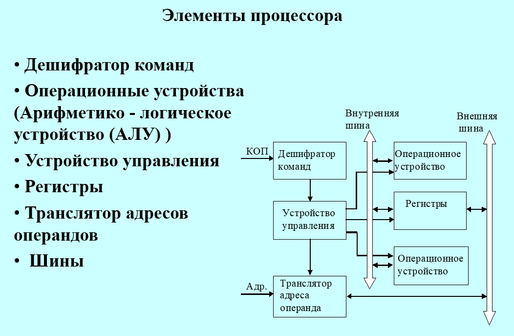
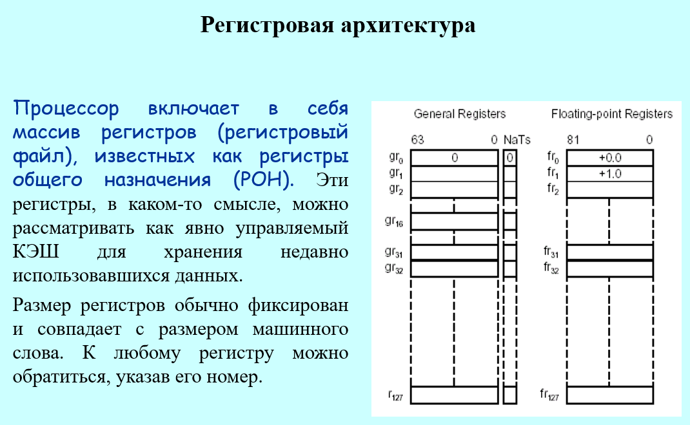
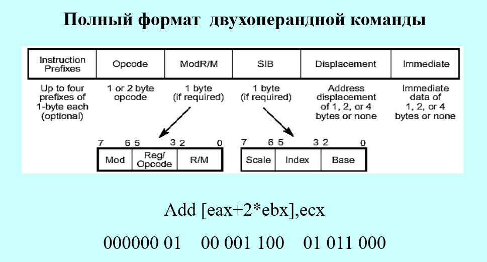

## Конспект лекций: Взаимодействие устройств ЭВМ и рабочий цикл процессора

## Тема 1. Представление данных и команд в ЭВМ

# 1.1. Представление данных
Данные и исполняемые команды хранятся в оперативной памяти (ОП), а их обработку выполняет процессор.

* Числа: представляются в двоичной системе счисления в форматах с фиксированной или плавающей точкой.
* Символы: кодируются с помощью двоичных кодов.
* Двоичные вектора: (для поразрядных логических операций) представляются последовательностями битов, хранящимися обычно в беззнаковых целых типах.

# 1.2. Представление команд
Команда — это приказ ЭВМ на выполнение определенной операции над операндами.

* Структура двухадресной команды: [ КОП | Адрес 1-го операнда (А1) | Адрес 2-го операнда (А2) ].
* Результат операции чаще всего записывается в ОП на место первого операнда (A₁).
* Система команд процессора — это полный набор всех команд, которые способен выполнять конкретный процессор (арифметические, логические, пересылки, передачи управления, ввода-вывода и др.).

## Тема 2. Аппаратное обеспечение рабочего цикла

# 2.1. Основные устройства и регистры

* УУиС (Устройство управления и синхронизации) — координирует работу всех узлов процессора.
* СчАК (или СК / PC) (Счетчик адреса команды) — хранит адрес следующей команды, подлежащей выборке и исполнению. Его разрядность зависит от объема ОП.
* РК (Регистр команд) — хранит текущую исполняемую команду на протяжении всего её рабочего цикла.
* АЛУ (Арифметико-логическое устройство) — содержит два регистра для операндов. Один из них — аккумулятор (Р1), принимающий один из операндов и сохраняющий итоговый результат. Второй регистр — Р2.
* ПортА и ПортД — порты адреса и данных, связывающие процессор с шинами.
* РАОП и РСОП — регистр адреса ОП и регистр слова ОП соответственно (узлы памяти).
* DC — дешифратор кода операции (КОП).

# 2.2. Принцип обмена с оперативной памятью

* Чтение (ЧтОП): Процессор передает адрес в РАОП (через ПортА) и активирует сигнал ЧтОП. Считанное слово из РСОП через шину данных пересылается в ПортД.
* Запись (ЗпОП): Процессор выставляет адрес в РАОП, данные — в РСОП (через ПортД), и генерирует управляющий сигнал ЗпОП.

## Тема 3. Рабочий цикл процессора (на примере двухадресной команды)
Процесс выполнения любой машинной команды делится на фиксированные этапы (микрокоманды):

# Этап 1. Выборка команды из ОП

   1. y1: ПортА := СчАК — адрес текущей команды передается на шину адреса.
   2. y2: ЧтОП — инициируется чтение из памяти.
   3. y3: РК := ПортД — код считанной команды записывается из шины данных в регистр команд.

# Этап 2. Выборка операндов из ОП

* Выборка 1-го операнда:
4. y4: ПортА := A1 — передача адреса первого операнда.
5. y2: ЧтОП — чтение из памяти.
6. y5: P1 := ПортД — запись операнда в первый регистр АЛУ (аккумулятор).
* Выборка 2-го операнда:
7. y6: ПортА := A2 — передача адреса второго операнда.
8. y2: ЧтОП — чтение из памяти.
9. y7: P2 := ПортД — запись операнда во второй регистр АЛУ.

# Этап 3. Выполнение операции в АЛУ

   1. Код операции (КОП) из РК расшифровывается дешифратором (DC), выдавая сигнал $x_i = 1$. УУиС формирует управляющий сигнал $y_i^{A\text{ЛУ}} = 1$. АЛУ выполняет операцию и сохраняет результат в аккумуляторе (P₁).

# Этап 4. Запись результата в ОП

   1. y8: ПортД := Р1 — результат переносится в порт данных.
   2. y4: ПортА := А1 — выставляется адрес первого операнда (куда пишем).
   3. y9: ЗпОП — подается сигнал записи в память.

# Этап 5. Продвижение СчАК

   1. y10: СчАК := СчАК + L — к счетчику прибавляется длина выполненной команды (L байт) для перехода к следующей инструкции.

## Тема 4. Регистры признаков и флагов АЛУ
Для отслеживания состояния процессора и результатов вычислений используются дополнительные узлы:

# 4.1. Сигнал Занятости ($Z_{\text{АЛУ}}$)
Во время работы АЛУ выставляет на линии ШАЛУ(8) сигнал $Z_{\text{АЛУ}} = 1$ (занято). Процессор переходит в режим ожидания. Установка $Z_{\text{АЛУ}} = 0$ сообщает УУиС о завершении операции и готовности к следующему шагу.

# 4.2. Регистр признака результата (РПР)
После выполнения команд (add, sub, inc, dec, and, or, xor) АЛУ выдает на ШАЛУ(0:3) унитарный код признака, преобразуемый шифратором (Coder) в 2-разрядный позиционный код:

* 00 — Результат равен нулю (P₁ = 0)
* 01 — Результат меньше нуля (P₁ < 0)
* 10 — Результат больше нуля (P₁ > 0)
* 11 — Переполнение с фиксированной точкой (ППФТ)

Этот код фиксируется на РПР в рамках 4-го этапа рабочего цикла (y11: PПР(0:1) := Coder(ШАЛУ(0:3))).
# 4.3. Регистр флагов прерываний (РФ)
Служит для фиксации исключительных ситуаций АЛУ на линии ШАЛУ(3:7) (y12: PФ(0:4) := ШАЛУ(3:7)):

* ШАЛУ(4)=1 — переполнение порядка (плавающая точка).
* ШАЛУ(5)=1 — исчезновение порядка.
* ШАЛУ(6)=1 — потеря значимости.
* ШАЛУ(7)=1 — деление на ноль.

## Тема 5. Организация ветвлений. Команда условного перехода
Для реализации ветвлений применяется команда условного перехода по маске.
# 5.1. Формат команды перехода
[ КОП (8 бит) | M (Маска, 4 бита) | А (Адрес перехода) ]

* Продвижение адреса в СчАК выполняется после выборки команды, но до её исполнения.

# 5.2. Логика работы маски (М)
Каждому биту маски соответствует определенное состояние РПР:

* РК(8) — проверка на равенство нулю (РПР = 00).
* РК(9) — проверка на меньше нуля (РПР = 01).
* РК(10) — проверка на больше нуля (РПР = 10).
* РК(11) — проверка на переполнение (РПР = 11).

Крайние случаи:

* Если M = 0000 (или A = 0) → переход не выполняется (NOP — нет операции).
* Если M = 1111 → переход выполняется всегда (безусловный переход).
* Если текущий код РПР совпадает с установленным битом в маске M, то текущий адрес в СчАК заменяется на адрес перехода A. В противном случае процессор продолжает выполнять команды по порядку.

## Тема 6. Прерывания программы и переключение задач
# 6.1. Типы прерываний

   1. Исключения (внутренние): возникают из-за ошибок в самой команде (деление на ноль, переполнение порядка). Не подлежат маскированию.
   2. Внешние прерывания: поступают от аппаратных устройств (клавиатура, таймер). Могут маскироваться через Регистр масок прерываний (РМ).
   3. Прерывания по таймеру: используются для организации мультипрограммного режима, выделяя каждой задаче квант времени τ (например, 1/30 с).

# 6.2. Аппаратный механизм обработки прерываний
Для реализации прерываний используются Регистр флагов (РФ), Таблица векторов прерываний (ТВП) в начале ОП и Указатель стека (УС). Стек работает по принципу LIFO (последним вошел — первым вышел).
Последовательность действий при возникновении прерывания ($F_i = 1$):

   1. Сохранение счетчика: Текущее значение СК (адрес возврата) записывается в ячейку ОП по адресу УС. Указатель стека инкрементируется:
   $$\text{ОП}[\text{УС}] = \text{СК}; \quad \text{УС} = \text{УС} + 1$$ 
   2. Переход к ТВП: В СК записывается номер прерывания i:
   $$\text{СК} = i$$ 
   3. Векторный переход: Процессор считывает из i-й ячейки ТВП команду безусловного перехода JMP $A_i$ на начало обработчика. Счетчик принимает значение:
   $$\text{СК} = A_i$$ 
   4. Выполняется подпрограмма обработки прерывания.
   5. Возврат: Подпрограмма завершается командой RETI (Return Interrupt). УС декрементируется, из стека восстанавливается старое значение СК:
   $$\text{УС} = \text{УС} - 1; \quad \text{СК} = \text{ОП}[\text{УС}]$$ 

Важное ограничение: Векторная система прерываний автоматически сохраняет только адрес возврата (СК). Сохранение и восстановление остальных критичных регистров процессора (РОН, РПР) при входе и выходе из обработчика ложится на плечи программиста, либо реализуется в продвинутых системах через сохранение Слова состояния программы (ССП / PSW).

## Ссылки на теоретический материал:
[Рабочий цикл процессора:](../../Theory/CPU_Duty_Cycle.ppt)
[Процессор:](../../Theory/Processor.pptx)